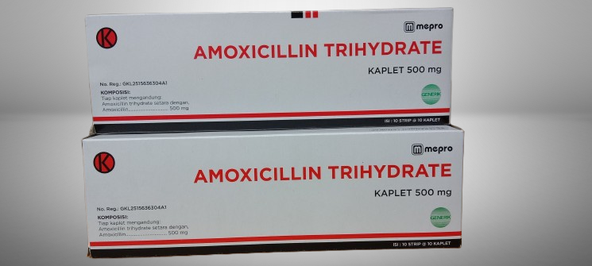
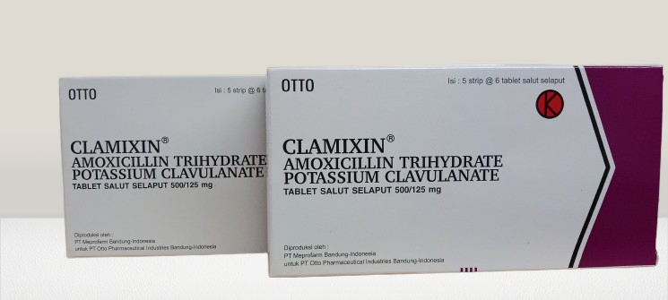
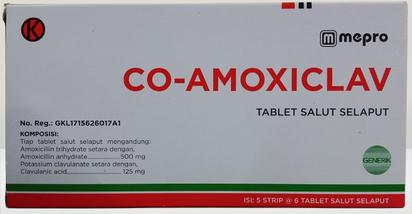

<html lang="id">
<head>
  <meta charset="UTF-8">
  <meta name="viewport" content="width=device-width, initial-scale=1.0"
  <link href="https://fonts.googleapis.com/css2?family=Playfair+Display:wght@500;700&family=Poppins:wght@400;600&display=swap" rel="stylesheet">
  
</head>
<body>
  <audio autoplay loop>
    <source src="dreams.mp3" type="audio/mpeg">
  </audio>

  <header>
    <h1>Betalaktam Penisilin</h1>
    
PT Meprofarm Pharmaceutical Industries

  </header>

  <section>
    

      

        
        <h3>Amoxicillin</h3>
        
Antibiotik spektrum luas yang efektif melawan berbagai infeksi bakteri. Digunakan untuk infeksi saluran pernapasan, telinga, dan kulit.

      

      

        
        <h3>Ancla</h3>
        
Produk turunan penisilin dengan efektivitas tinggi terhadap bakteri gram positif dan negatif. Diformulasikan untuk efektivitas optimal.

      

      

        
        <h3>Clamixin</h3>
        
Antibiotik kombinasi yang bekerja menghentikan pertumbuhan bakteri penyebab infeksi pada sistem pernapasan dan pencernaan.

      

      

        
        <h3>Co-Amoxiclav</h3>
        
Kombinasi Amoxicillin dan Clavulanic Acid yang meningkatkan efektivitas terhadap bakteri yang resisten terhadap antibiotik biasa.

      

    

  </section>

  <footer>
    

      <button class="like-btn" onclick="likeWebsite()"> Like (0)</button>
    

    

      <h3>Komentar</h3>
      <textarea id="commentInput" placeholder="Tulis komentar Anda..."></textarea> 
      <button class="comment-btn" onclick="addComment()">Kirim</button>
      

    

    
© 2025 Gilang Muhamad Husen. All Rights Reserved.

  </footer>

  
</body>
</html>

